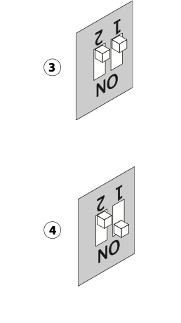

# Переустановка сервера Fiery
[Гайд]()  
Под VPN качаем:   
[Fiery USB Setup Tool](https://www.support.xerox.com/ru-ru/content/138164)  
[Xerox EX-i Print Server Powered by Fiery® System Software ISO v2.1](https://www.support.xerox.com/en-us/product/xerox-color-c60-c70/content/139876)  
[Xerox EX-i Print Server Powered by Fiery® System Software ISO v2.1](https://www.support.xerox.com/en-us/product/xerox-color-c60-c70/content/139876)
При установке приложение подвисает - ждем  
После установки ищем в приложениях Fiery USB Setup Tool  
Открываем   
Приложение кривоекосое перетягиваем в него файл iso сначала из папки server потом из папки user.
???+ note "Заметка"
     Может лагать и не перетягиваеться пробуем закрыать приложение переустанавливать итд
выбираем флешку
???+ note "Заметка"
    Если прошивка крашится, пробуем другую флешку
Выключаем питание принтера и сервера печати   
Из сервера печти выдергиваем все провода  
Вставляем прошитую флешку в любой usb порт  
Dip переключатели на лицевой панели устанавливаем 1-on 2- off
  
Включаем питание тумбелром сверху  
Нажимаем кнопку питания  
Сервер тупит 1-3 минуты далее начинает по кругу переключать c1-c2-c3 на дисплее  
Ждем минут 5-10 сервер выключится  
Возвращаем все провода обратно  
Включаем сервер кнопкой  
Далее ждем минут 15, при этом сервер неоднократно перезагрузится  
Выключаем  
Включаем вместе с принтером  
Готово пароль админа по умолчанию Fiery.1