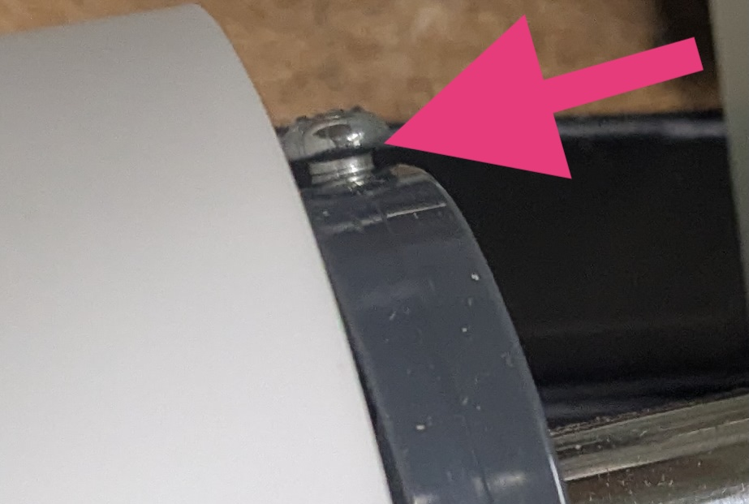
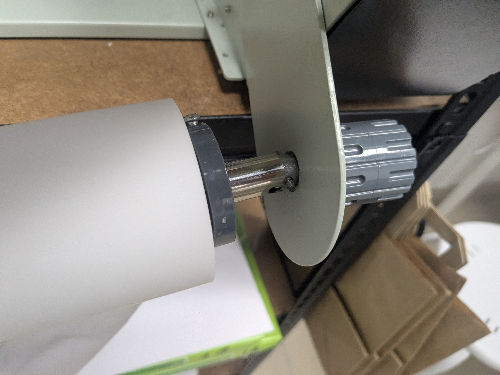
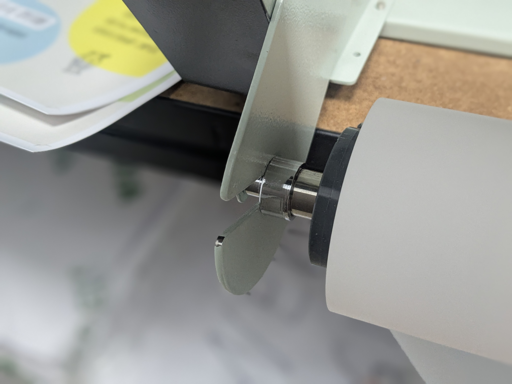
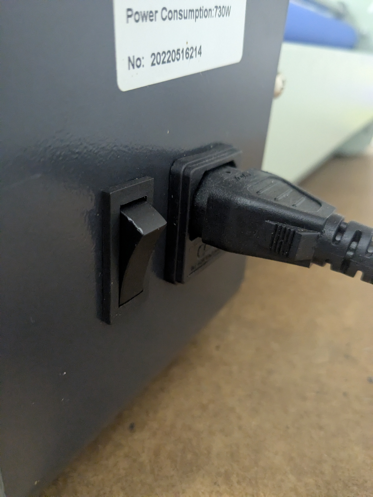
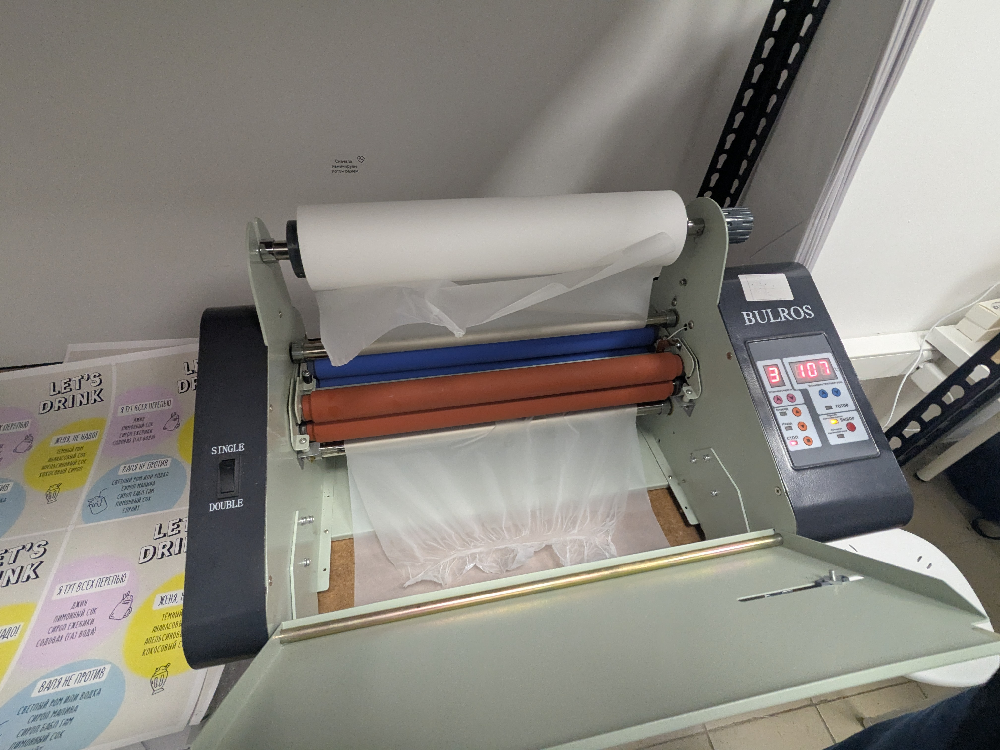

# Использование ламинатора Bulros FM 360
На данной странице рассказывается о том, как правильно ламинировать документы с помощью ламинатора Bulros FM 360

## 1. Установка пленки 
Для замены пленки:

* Снимите ролик с пленкой вместе с внутренней штангой
* Открутите винт

Установите новый ролик с пленкой
!!! warning "Важно"

    Ролик нужно установить в том же направлении, что и был установлен ранее

Закручиваем винт на место 

Вставляем в паз справа

Вставляем в паз слева

!!! tip "заметка"

    Возможно потребуются усилия

## 2. Включение и настройка  
Подключите устройство к сети 
Включите ламинатор, нажав кнопку питания 

Нажмите кнопку "Горячая ламинация"
Установите температуру и скорость: 

| Температура | Скорость вращения |
| ----------- | ----------------- |
| 115-125     | 1-3               |
| 126-135     | 4-6               |
| 135+        | 7                 |

Подождите, пока вал нагреется (обычно 3–5 минут)

!!! tip "Заметка"

    Пока вал разогревается, его необходимо отчиситить от остатков клея 

Временно выключите вращение    
Понимите столик  
Заправьте пленку следующим образом

Шаг 1. Протяните пленку за металлические валы 

Шаг 2. Положите пленку внахлест на красные валы

Опустите столик

## 3. Процесс ламинирования  
Включите вращение на 1 скорость  
Плотным куском бумаги пропихните пленку в первый (горчий) вал
!!! danger "Внимание"
       Пленку может намотать на горячий вал, рекомендуется ее пропихнуть к следующим (холодным) валам
Вытяните пленку из холодных валов  
Выставите рабочую скорость и можно ламинировать
!!! tip "Заметка"

    Не тяните и не толкайте материал — ролики сами протянут его
  

## 4. Завершение работы  
Выключите устройство и дайте ему остыть  
Очистите рабочую зону от остатков пленки  
Если на валах остались следы клея, удалите их влажными салфетками

## 5. Возможные проблемы и их решение  

| Проблема | Возможная причина | Решение |
|----------|------------------|---------|
| Пузырьки воздуха под пленкой | Недостаточно нагрева | Увеличьте температуру |
| Ламинированный материал выходит смятым | Неравномерное натяжение пленки | Проверьте натяжение и равномерность подачи |
| Остатки клея на изделии | Загрязнение валов | Очистите валы и используйте качественную пленку |
