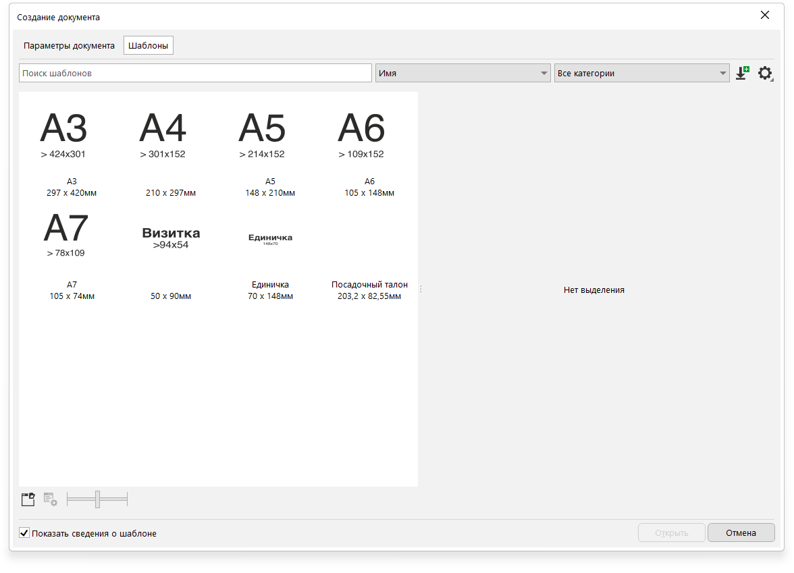
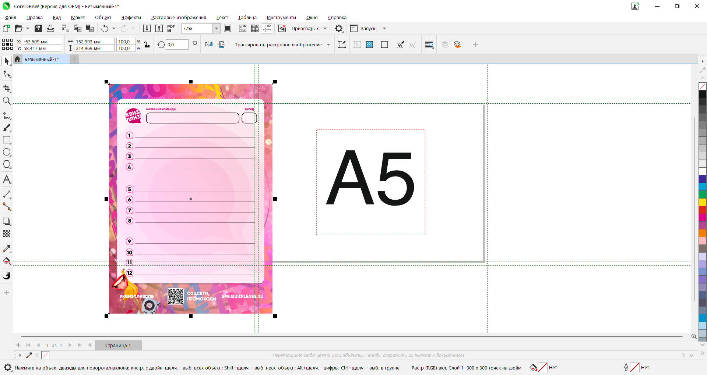
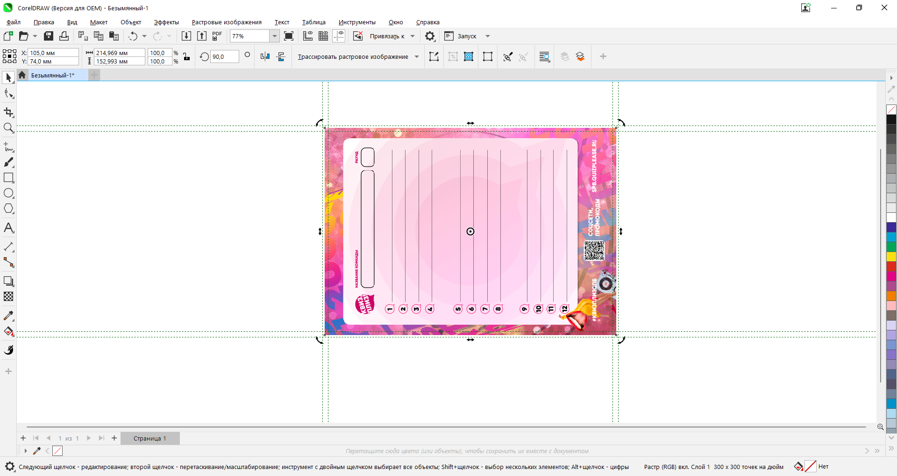
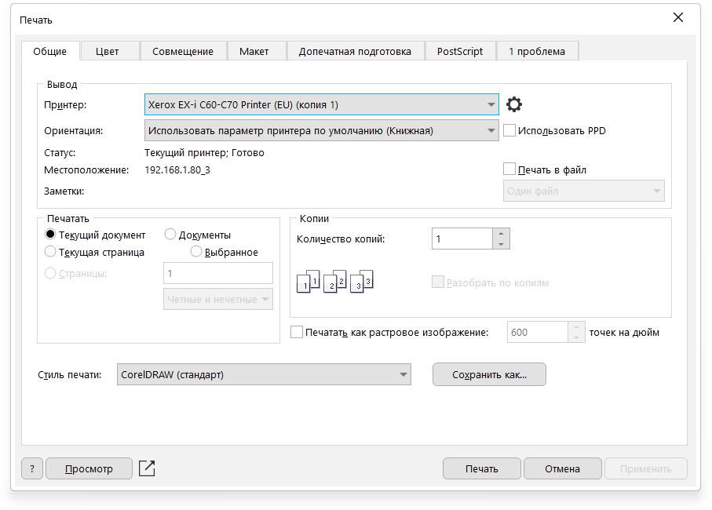
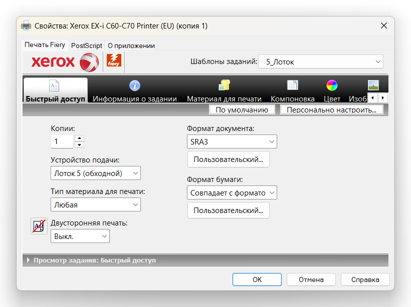
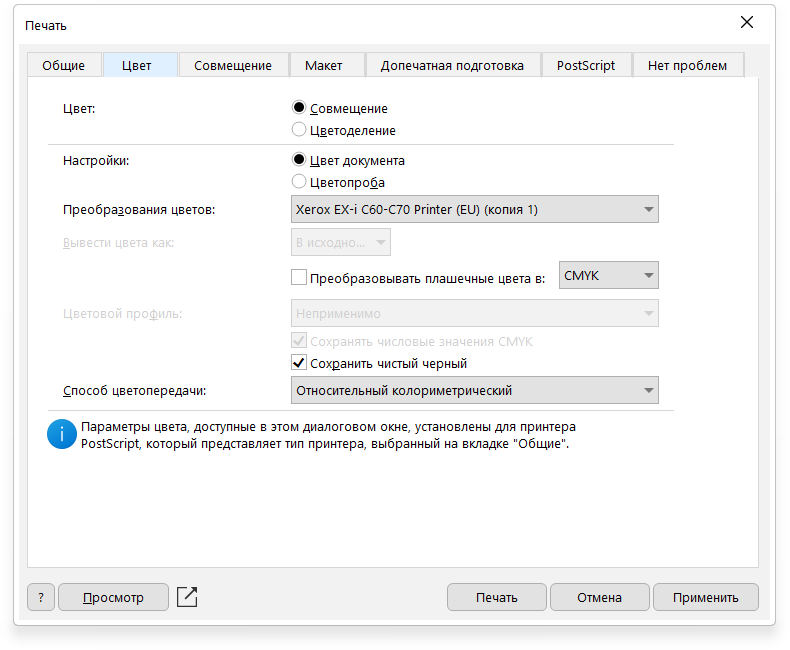
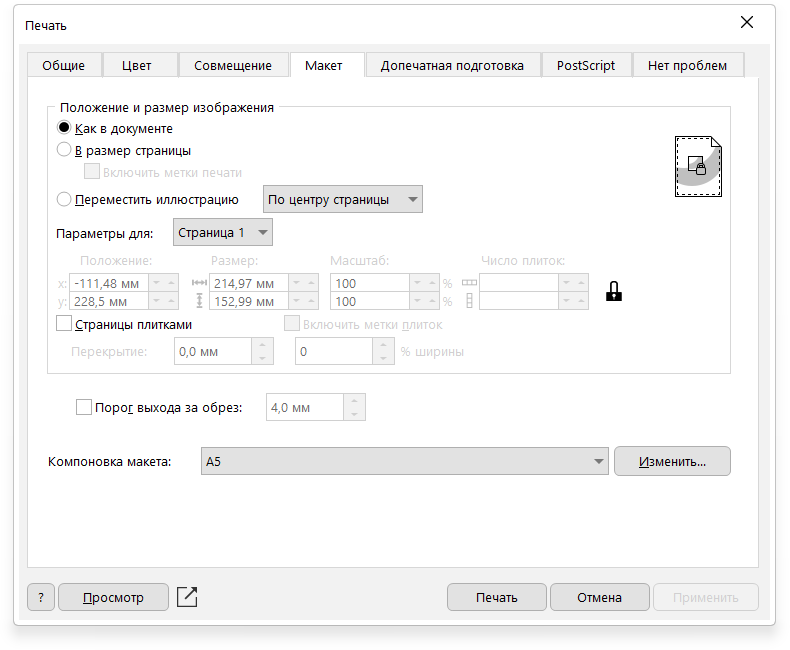
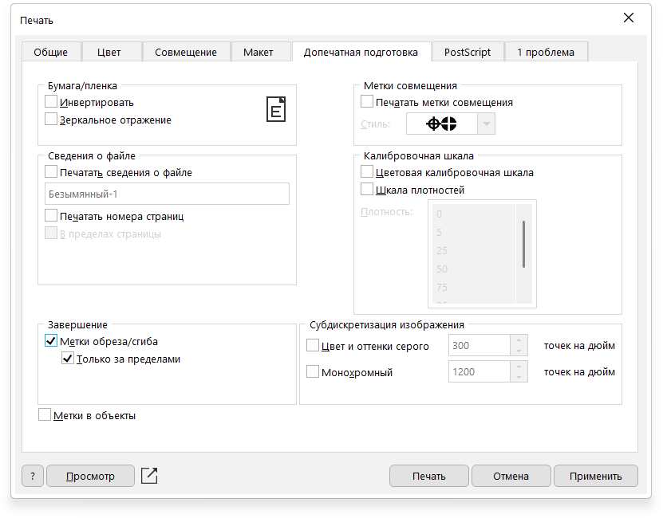

# Печать из CorelDRAW
Открываем CorelDRAW. Нажимаем "Создать из шаблона"

Выбираем необходимый шаблон. Если готовый шаблон вам не подходит выбираем любой и его корректируем

???+ note "Заметка"
    Если, популярного формата в шаблонах нет, то лучше его сохранить и пользоваться в последствии
После открытия перетягиваем макет в рабочую облать.  
Если макет требуется повернуть на панели сверку в инструменте поворот(:fontawesome-solid-rotate-right:) вводим 90 и нажимаем ++enter++ (либо сочетание клавиш ++shift+r++)  
Далее размещаем макет по центру нажатием кнопки ++p++

   
Проверяем макет. На макете должны быть:  

* Поля минимум 2 мм. с каждой стороны
* Минимум в 2 мм. от линий обрезки не должно быть ценной информации
* Проверяем как выглядят шрифты, векторные изображения (только для PDF)

Далее нажимаем файл > печать (сочетание ++ctrl+p++)

Выбираем принтер "Xerox EX-i C60-C70 Printer (EU)"  
Нажимаем :octicons-gear-24:

Выбирааем шаблон задания "Лоток 5" и закрываем

На вкладке "Цвет" устанавливаем Преобразования цветов "Xerox EX-i C60-C70 Printer (EU)"

На вкладке "Макет" указываем требуемую нам компоновку
???+ note "Заметка"
    Если, популярного формата компоновки в шаблонах нет, то лучше его сохранить и пользоваться в последствии

На вкладке "Макет" Ввыбираем шаблон печати
  
Отправляем напечать :partying_face: